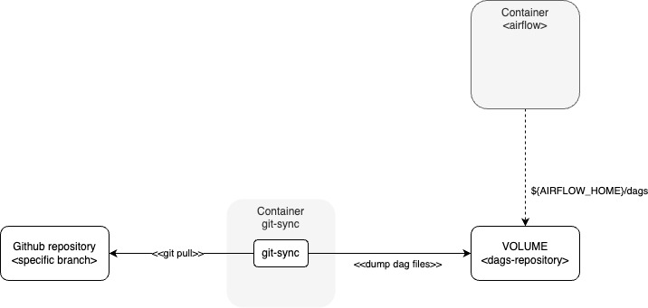

# git-sync

git-sync is POC repository to syncronize a dags repository into a Docker VOLUME shared with an AIRFLOW contained


<p align="center">
  
</p>


## Usage

### Build the containes
```
docker build -t git-sync:latest .
```

### run the git-sync container

```
# using the container with the default values defined
docker run -d -v dags_repository:/git -v logs_repository:/logs git-sync:latest
```


docker build --build-arg arg=2.3 .


```
# passing the environment variables
docker run \
    -e GIT_SYNC_REPO=https://github.com/fzioli/git-sync-testing.git \
    -e GIT_SYNC_DEST=/git \
    -e GIT_SYNC_BRANCH=main \
    -e GIT_SYNC_REV=FETCH_HEAD \
    -e GIT_SYNC_WAIT=20 \
    -v dags_repository:/git \
    -v logs_repository:/logs \
    -d git-sync:latest
```
